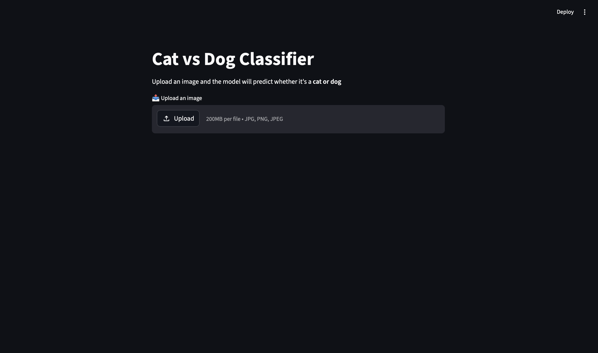
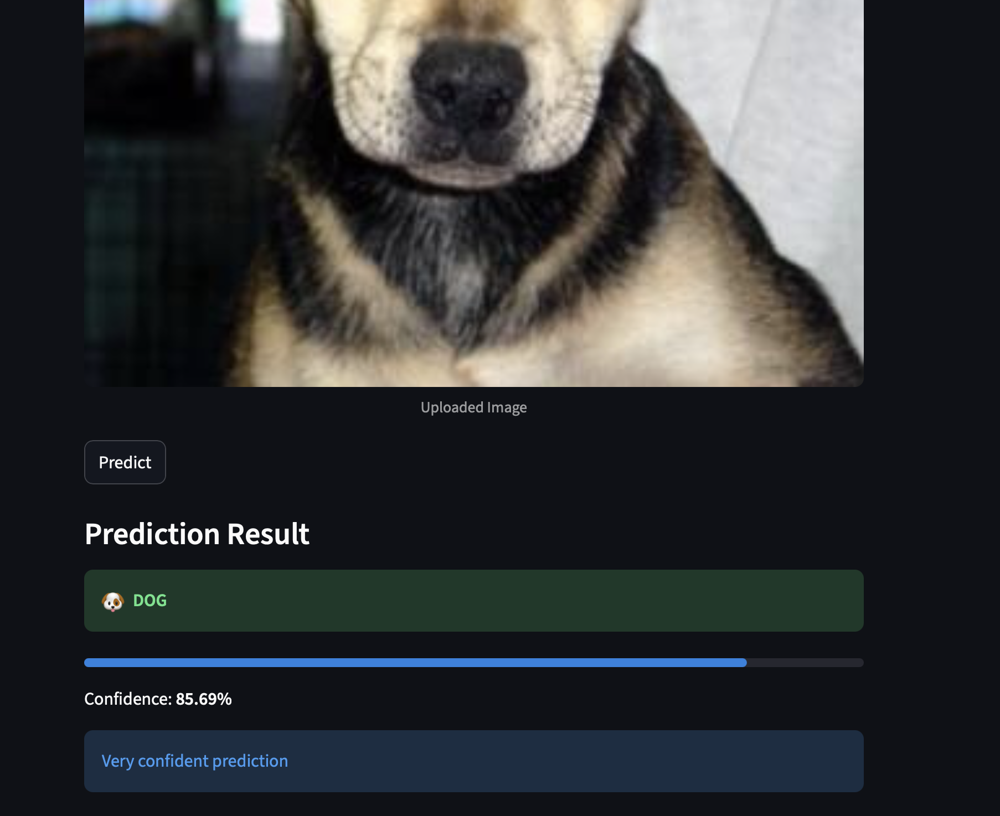

# 🧠 Cat vs Dog Image Classifier

A deep learning-powered web app that classifies images as **Cat 🐱 or Dog 🐶** with real-time predictions.

Built using **TensorFlow (MobileNetV2)** and deployed with an interactive **Streamlit UI**, this project demonstrates an end-to-end ML workflow—from training to deployment.

---


### Screenshots

#### Upload Interface

```

```

#### Prediction Output

```

```

---

## Features

*  Binary Image Classification (Cat vs Dog)
*  Real-time prediction with confidence score
*  Transfer Learning using MobileNetV2
*  Clean and interactive Streamlit UI
*  Training logs and performance tracking
*  Optional FastAPI backend for scalability

---

##  Tech Stack

* **Deep Learning**: TensorFlow / Keras
* **Frontend**: Streamlit
* **Backend (Optional)**: FastAPI
* **Libraries**: NumPy, PIL, scikit-learn

---

##  Project Structure

```
image-classifier/
│
├── app/
│   ├── streamlit_app.py     # UI
│   ├── predict.py           # Prediction logic
│
├── api/
│   └── main.py              # FastAPI backend
│
├── model/
│   └── final_model.keras    # Trained model
│
├── assets/                  # Screenshots & GIFs
│
├── requirements.txt
├── README.md
```

---

## Installation & Setup

```bash
git clone https://github.com/rajthakkar2009/Image-Identifier.git
cd Image-Identifier

python -m venv venv
source venv/bin/activate   # Mac/Linux
# venv\Scripts\activate    # Windows

pip install -r requirements.txt
```

---

##  Run the App

###  Streamlit UI

```bash
streamlit run app/streamlit_app.py
```

---

### FastAPI Backend (Optional)

```bash
uvicorn api.main:app --reload
```

---

## Model Details

* Architecture: **MobileNetV2 (Transfer Learning)**
* Input Size: 224x224
* Output: Binary (Cat / Dog)
* Loss Function: Binary Crossentropy
* Optimizer: Adam

---

## Results

> *(Add your actual accuracy here)*

* Training Accuracy: **99%**
* Validation Accuracy: **98%**

---

## Future Improvements

*  Multi-class classification
*  Mobile-friendly UI
*  Cloud deployment (AWS / GCP)
*  Explainability (Grad-CAM visualization)

---

## Contributing

Contributions are welcome! Feel free to fork the repo and submit a PR.

---

## 📬 Contact

**Raj Thakkar**
📍 Mumbai, India

---

## ⭐ If you like this project

Give it a ⭐ on GitHub—it helps a lot!
